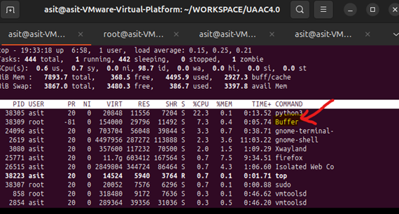
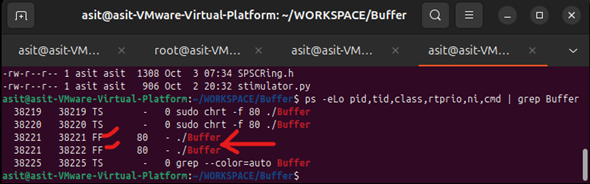
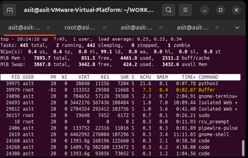
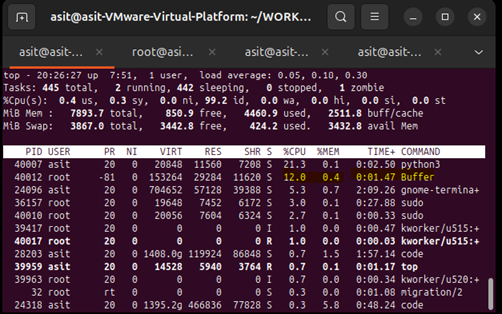

# How to Run the Buffer Application 

```markdown
**Step 1: Run the Python Stimulator**  
```

**`python3 stimulator.py`**
```
**Step 2: Run the Qt Console Application**  
```
**`sudo chrt -f 80 ./Buffer`**
```
**Step 3: Test if Buffer Application is running**  
```
**`top  `**


```
**Step 4: Verify OS Level Thread Priority for Buffer**  
```
**`ps -eLo pid,tid,class,rtprio,ni,cmd | grep Buffer  `** 



```
**Step 5: Run With Boost Library**  
```
cd /home/asit/WORKSPACE/Buffer/build/Qt6_8_3-Debug/
**`sudo chrt -f 80 ./Buffer --ring=boost `** 



```
**Step 6: Run MPMC Buffer With Root Privileges**
```
**`sudo chrt -f 80 ./Buffer  `**




***
